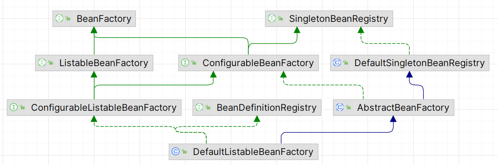

# spring-framework-simplification

## 基本说明

#### 介绍

spring框架学习目的使用

将spring-framework系列的框架理解拆分，变成简单的只保留主要流程的框架，只保留其核心内容

目的用于学习spring系列，总体设想为根据spring的思想梳理其主体，整理主要流程。

此框架因只保留了核心逻辑，因此存在大量bug和未知问题，也可能没有考虑到官方的强拓展性，胡乱在项目中使用后果自负哦

#### 软件架构
软件架构说明

和spring框架保持一致的命名、模块划分、功能分布，尽量的模仿原框架

#### 使用说明

1.  web 入口
    web的入口为 webapp/Web-INF/web.xml中，通过配置<listener>标签启动Spring容器
2.  xxxx
3.  xxxx

## 模块解析

### 依

### spring-core
    spring的核心模块，主要定义基础的工具、环境变量、流
### spring-beans
    主要与bean相关定义，包含了bean的创建工厂BeanFactory、bean的定义信息BeanDefinition、
    注册和创建bean、保存bean的信息
#### 整体结构 

#### BeanFactory
    BeanFactory为bean的创建工厂抽象，主要定义了获取bean的方法
    很多接口和类都实现了beanfactory，因为beans包下主要就是对bean的操作
    其主要实现为 AbstractBeanFactory 抽象类，
#### ListableBeanFactory
    可配置的工厂，继承BeanFactory
    除了父定义，主要定义了 BeanDefinition的获取和校验方法
#### ConfigurableBeanFactory
    也是可配置的工厂，继承BeanFactory,SingletonBeanRegistry
    除了父定义，这里主要定义了扩展方法的添加，类别名等
#### ConfigurableListableBeanFactory
    继承ConfigurableBeanFactory，ListableBeanFactory
    配置接口将由大多数可列出的bean工厂实现。
    除了ConfigurableBeanFactory之外，它还提供了分析和修改bean定义以及预实例化单例的工具。
#### SingletonBeanRegistry / DefaultSingletonBeanRegistry
    单例容器注册接口，定义了单例bean的注册，获取方法
    实现类DefaultSingletonBeanRegistry内部包含了三级缓存的存储容器，实现了其定义的方法

#### AbstractBeanFactory
    实现ConfigurableBeanFactory,继承DefaultSingletonBeanRegistry
    因为继承了DefaultSingletonBeanRegistry，所以有能力实现Bean的获取，此抽象类完成了大部分的bean获取能力
    同时内部维护了beanPostProcessors列表，维护扩展能力
#### DefaultListableBeanFactory
    继承AbstractBeanFactory，同时实现了ConfigurableListableBeanFactory，BeanDefinitionRegistry
    最底层的实现类，维护了 beanDefinitionMap ，因此，得以实现创建bean的全过程，
    实现了ListableBeanFactory，因此也有获取bean定义的方法
    实现了BeanDefinitionRegistry，因此也有注册bean的方法

### spring-context

### 

## 流程说明
### xml启动主体流程
由Tomcat的 ServletContextListener 类调起
在xml的servlet配置中 配置<context-param>参数，指定contextClass=ContextLoaderListener，此Class实现ServletContextListener，Tomcat启动时，会执行此类的contextInitialized方法，从而开始启动容器类
启动时先创建WebApplicationContext上下文对象，然后从ServletContext中加载父对象，一般而言，此时是没有的，然后配置和刷新。
配置主要是把servletContext的相关东西设置到上下文中，方便后续取用不再使用servlet。
然后配置制定的ApplicationContextInitializer应用上下文初始化器，并执行初始化（自定义配置上下文）。之后开始刷新操作。
上下文的刷新操作refresh()反应了启动上下文的全流程。

    首先创建beanFactory工厂，创建工厂的方法中会加载beanDefinition定义，beanDefinition保存了需要加载到容器中的实例的一些属性信息，为很重要的实体。
    然后添加系统的BeanPostProcessor到工厂中
    再执行BeanDefinitionRegisterPostProcessor的初始化，因为涉及到BeanDifinition，保证这部分的功能先执行;
    再执行BeanPostProcessor 将容器配置的BeanPostProcessor首先初始化完成，保证后续调用初始化bean的时候可以使用，也就是说这鞋bean优先初始化
    再执行一些 initMessageSource initApplicationEventMulticaster onRefresh 等
    再执行监听器的初始化，用于监听对应的事件
    再执行工厂完成的初始化事件，在这里，我们会初始化bean

### spring-webmvc
    主要加载webmvc的9大组件

#### 初始化流程
    

#### 请求调用流程
    javax.servlet.HttpServlet#service()启动请求调用
    FrameworkSerlvet#service()重写此方法正式进入框架调用，通过doService抽象方法提供给子类实现
    DispatcherServlet#doService记录请求后调用doDispatch()正式进入MVC的调用环节
    1、首先通过请求获取到映射器HandlerMapping，并组装成HandlerExecutionChain拦截器调用链
    2、然后根据拦截器链的处理方法(一般为HandlerMethod或其容器中beanName)获取到处理器适配器HandlerAdapter
    3、执行拦截器链的pre方法(拦截器链中的拦截器pre方法挨个执行)
    4、执行请求方法，调起controller
    5、执行拦截器的after方法(拦截器链中的拦截器post方法挨个执行)
    6、处理异常等
    7、finally中执行拦截器的complate方法
    
##### 获取请求映射器
##### 获取适配器
##### 执行请求方法
    HandlerAdapter#handler()为执行方法，通常为实现类RequestMappingHandlerMapping。
    RequestMappingHandlerMapping主要执行方法为invokeHandlerMethod()，得到ModelAndView
    RequestMappingHandlerMapping#invokeHandlerMethod()构造一个ServletInvocableHandlerMethod执行器，并赋予初始值，此请求执行器将执行方法的全部过程
    ServletInvocableHandlerMethod#invokeAndHandle()分两步执行方法+处理好返回值
    ..invokeForRequest()中分为两步获取参数+执行方法
    ....getMethodArgumentValues()获取参数
    ....doInvoke()反射执行方法
    ..returnValueHandlers.handleReturnValue()中分为两步获取参数+执行方法
###### ServletInvocableHandlerMethod.getMethodArgumentValues() 参数解析
    主要由参数解析器负责处理，所有参数中每一个参数均调用一次参数解析器集合resolvers并选取一个处理，得到参数
    

## todo
    动态代理/切面逻辑
    bean的自动注入ByType注入暂未实现
    (03-27 ok)扩展函数 Aware、InitializingBean
    @PostConstruct、init-method
    (03-27 ok) ApplicationContextAware
    跨模块的classpath:META-INF/spring.handlers解析
    spring容器刷新过后springmvc又刷新一次，之后再看看咋弄
    springmvc的初始化应该从上下文监听器执行的，目前监听器功能还未实现，暂时未做

## 其它

#### 参与贡献

1.  Fork 本仓库
2.  新建 Feat_xxx 分支
3.  提交代码
4.  新建 Pull Request

#### 特技

1.  使用 Readme\_XXX.md 来支持不同的语言，例如 Readme\_en.md, Readme\_zh.md
2.  Gitee 官方博客 [blog.gitee.com](https://blog.gitee.com)
3.  你可以 [https://gitee.com/explore](https://gitee.com/explore) 这个地址来了解 Gitee 上的优秀开源项目
4.  [GVP](https://gitee.com/gvp) 全称是 Gitee 最有价值开源项目，是综合评定出的优秀开源项目
5.  Gitee 官方提供的使用手册 [https://gitee.com/help](https://gitee.com/help)
6.  Gitee 封面人物是一档用来展示 Gitee 会员风采的栏目 [https://gitee.com/gitee-stars/](https://gitee.com/gitee-stars/)
